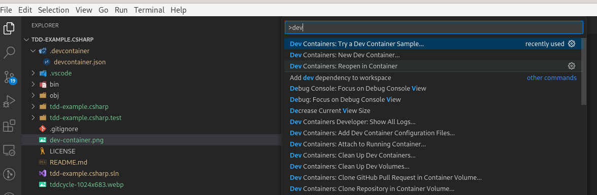
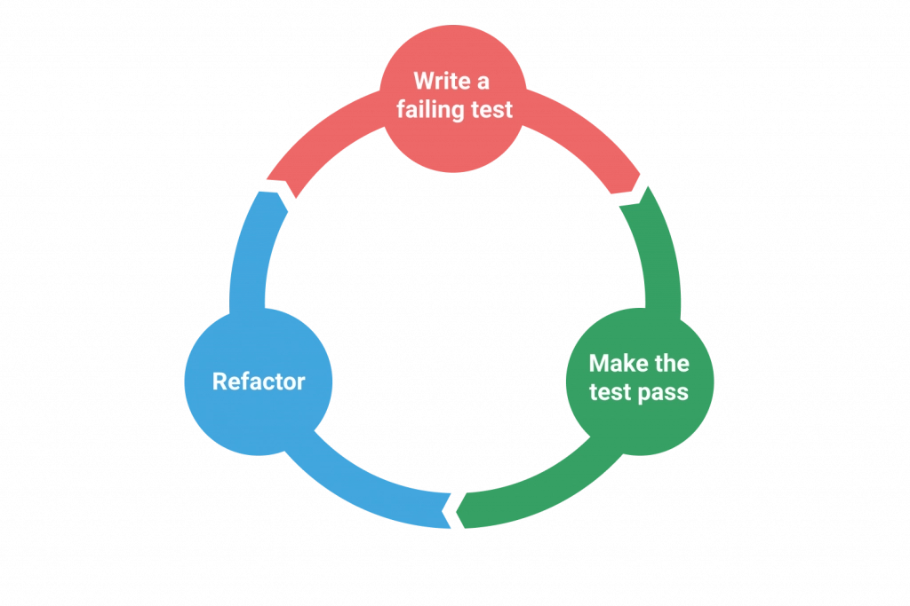

# Test Driven Development (TDD) Example using c#

The Example is about a StringCalculator which uses strings as an input and calculates their sum. 
It is a [code-kata](https://de.wikipedia.org/wiki/Kata_(Programmierung) which can be used to train TDD skills.

## Project Setup

1. > git clone https://github.com/amorscher/tdd-example.csharp.git
1. open vs-code in main dir
1. start using dev container
  

## Running the test

Open a terminal and go to `tdd-example.csharp.test` and execute:

> dotnet test

## The Example

There are several requirements provided which have to be implemented using the `Red-Green-Refactor` pattern of TDD:

**Following the rules:**

1. You are not allowed to write any production code unless it is to make a failing unit test pass.
2. You are not allowed to write any more of a unit test than is sufficient to fail, and compilation failures are failures.
3. You are not allowed to write any more production code than is sufficient to pass the one failing unit test.

> The example is taken from **[TDD-StringCalculator](https://tddmanifesto.com/exercises/) Kata 2 - String Calculator**, with some minor adaptions. 

**The requirements:**

1. The method can take up to two number separated by commas and will return their sum as a result. So the inputs can be: "","0", "1,2".

2. For an empty string it will return 0.

3. Method will return their sum of numbers

4. Allow the add method to handle an unknown number of arguments

5. Allow the add method to handle newlines as separators, instead of comas

    - “1,2\n3” should return “6”
    - “2,\n3” is invalid, but no need to clarify it with the program

6. Allow the add method to handle different delimiters

    - To change the delimiter, the beginning of the input will contain a separate line that looks like this:
      > //[delimiter]\n[numbers]
    - “//;\n1;3” should return “4”
    - “//|\n1|2|3” should return “6”
    - “//sep\n2sep5” should return “7”
    - “//|\n1|2,3” is invalid and should return an error (or throw an exception) with the message “‘|’ expected but ‘,’ found at position 3.”

7. Calling add with negative numbers will return the message or throw an exception “Negative number(s) not allowed: <negativeNumbers>”

    - “1,-2” is invalid and should return the message “Negative number(s) not allowed: -2”
    - “2,-4,-9” is invalid and should return the message “Negative number(s) not allowed: -4, -9”

8. Numbers bigger than 100 should be ignored

Additional requirements:

9. Delimiters can be of any length
    - Following format should be used: “//[delimiter]\n”. Example: “//[—]\n1—2—3” should return 6

10. Allow multiple delimiters
    - Following format should be used: “//[delim1][delim2]\n”. Example “//[-][%]\n1-2%3” should return 6.

11. Make sure you can also handle multiple delimiters with length longer than one char
